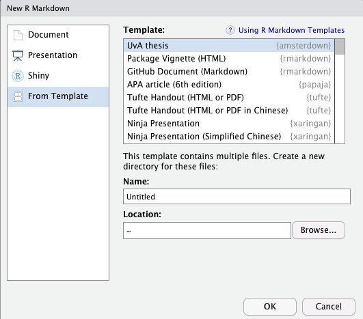

```{r, include = FALSE}
knitr::opts_chunk$set(
  collapse = TRUE,
  comment = "#>"
)
```


The best way to figure out how the template works is to look at [the source files](https://github.com/lcreteig/amsterdown/tree/master/inst/rmarkdown/templates/thesis/skeleton) and output together, to understand how one is created from the other. Other than how to create headings, italic text and the like, I've included basic examples of things you're likely to need whilst writing a thesis, such as citations, tables, plots, and equations.

Or, check out the source files for [my PhD thesis](https://github.com/lcreteig/thesis), or any other PhD thesis templates (e.g. [thesisdown](https://github.com/ismayc/thesisdown), [huskydown](https://github.com/benmarwick/huskydown), or [oxforddown](https://github.com/ulyngs/oxforddown)).

For more extensive documentation, please see these other excellent sources on Markdown syntax, R Markdown, and `bookdown`:

* Almost everything you'll need to know can be found in the [bookdown book](https://bookdown.org/yihui/bookdown/).
* For a quick (R) Markdown reference, check out [RStudio's R Markdown cheat sheet](https://rstudio.com/resources/cheatsheets/).
* R Markdown uses pandoc-flavored Markdown, the complete reference for which is [pandoc's  documentation](https://pandoc.org/MANUAL.html#pandocs-markdown).
* The integration of R code is handled by the [knitr package](https://yihui.name/knitr/). Code chunks can be customized with many options  that determine how the output is displayed (e.g., whether the code is included; if a plot is generated, what it's size should be, etc.). Check out a complete overview of these options [here](https://yihui.name/knitr/options/).

## Before we start

1. Install the `amsterdown` package from GitHub;

```{r, eval = FALSE}
if(!require(devtools)) install.packages("devtools") # devtools package allows installation of packages from github
devtools::install_github("lcreteig/amsterdown") # install amsterdown from github
```

N.B. you __don't__ need to load the package (e.g. with `library(amsterdown)`) in order to use it; the only reason it's a package is that the package structure is just the easiest way to get the template files and dependencies (the `rmarkdown`, `knitr`, and `bookdown` packages) to you.

2. If you don't have `pandoc`, you'll need to [install that as well](https://pandoc.org/installing.html). Note that [RStudio](https://rstudio.com/) comes bundled with `pandoc`, so if you're using RStudio you should be all set.

3. To make the PDF version of the thesis, you'll also need a LaTeX distribution. If you have one installed already, you should be good to go. If not, I recommend [TinyTeX](https://yihui.name/tinytex/). The `tinytex` package should come bundled with `bookdown` (and thus `amsterdown`), which allows you to easily install the LaTeX distribution from R:

```{r, eval = FALSE}
tinytex::install_tinytex()
```

N.B. If you're working with RStudio, you'll need to restart it after installing TinyTeX.

## Drafting the template

### Using the RStudio interface

1. Go to "File" in the menu bar, then choose "New File" > "R Markdown...". 
2. In the following screen (see the screenshot below), click "From Template" in the bar on the left. Then select "UvA thesis" {amsterdown}. If you don't see {amsterdown} in this list, but you have (just) installed the package, you may need to restart RStudio.
3. Choose any folder on your computer to store the files (under "Location"). However, make sure to name this directory `index` (under "Name"). This is only to ensure that the main file will be correctly named `index.Rmd`; after the template has been created, feel free to change the name of the directory.

```{r echo = FALSE, out.width='50%'}

```

It's good practice to also create an [RStudio project](https://support.rstudio.com/hc/en-us/articles/200526207-Using-Projects) for your thesis. This'll make sure your working directory is set correctly, and it will allow you to use the nifty "Build Book" button to easily render the thesis (see [Building the thesis, Using RStudio](#build-rstudio)). Whenever you want to resume working on the thesis, open the `.Rproj` file that's created in this step.

4. To create an RStudio project, go to "File" in the menu bar, then choose "New Project..."

5. In the following screen (see the screenshot below), select "Existing Directory".

```{r echo = FALSE, out.width='50%'}
knitr::include_graphics("../man/figures/newproject-1.png")
```

6. Then click "Browse...", and navigate to the directory you just created (the default name is `index`, but you probably have changed it by now). Finally, click "Create Project".

```{r echo = FALSE, out.width='50%'}
knitr::include_graphics("../man/figures/newproject-2.png")
```

### From the console

You can also use the `rmarkdown::draft()` function to create the template files (e.g. if you're not using RStudio):

```{r eval = FALSE}
rmarkdown::draft('index.Rmd', # create new draft based off template
                 template = 'thesis', package = 'amsterdown', 
                 create_dir = TRUE, edit = FALSE) 
```

Again, this will also create a directory named `index`, but feel free to change that name.

## The template files

Your newly created folder with the thesis template should contain the following files.

```{r, echo = FALSE}
#fs::dir_tree(here::here("inst/rmarkdown/templates/thesis/skeleton"))
```
```
├── 01-introduction.Rmd
├── 02-chapter.Rmd
├── 03-chapter.Rmd
├── 04-discussion.Rmd
├── 05-supplement.Rmd
├── 06-references.Rmd
├── 07-summary-Dutch.Rmd
├── 08-acknowledgments.Rmd
├── 09-miscellaneous.Rmd
├── _00-preface.Rmd
├── _bookdown.yml
├── figures
│   ├── uvalogo_regular_p_en.jpg
│   └── uvalogo_regular_p_en.pdf
├── index.Rmd
├── template.tex
└── thesis.bib
```

* The `.Rmd` (R Markdown) files each contain a single chapter. The easiest way to keep them in order is by prefixing a number to the file name: this ordering will also determine the order of the chapters in the book. However, this doesn't hold for two of these:
    * `index.Rmd` does not actually contain any R Markdown content, but only YAML options that determine how the book will be rendered. See the [YAML variables](#yaml-variables) section below. The name of this file must be `index.Rmd`, as it will become the "home page" of the HTML version of the thesis (which is only recognized if it is named `index.html`)
    * `_00-preface.Rmd` will only show in the HTML version of the thesis; it is intended to house some of the info that's in the front matter of the PDF version of the book (e.g. funding info, names of your supervisors, etc.). It does not follow the regular ordering scheme: this will always come first, because it is referred to directly in `index.Rmd`. If you don't want something like this, simply remove the code chunk in `index.Rmd` that references it.
* `_bookdown.yml` contains a few more YAML options. See the [bookdown book](https://bookdown.org/yihui/bookdown/) for more info, though you likely won't ever have to change any of these.
* the `/figures` folder contains some example images included in the template (the UvA logo).
* `template.tex` is the pandoc LaTeX template that will determine how the PDF output of the thesis will look. If you ever want to change something about the PDF (e.g., the font that's used, where the page numbers are, etc.), you'll likely have to modify this file and add some LaTeX commands. Note that the html version of the thesis also has [a template](https://www.gitbook.com/), but this cannot be modified.
* `thesis.bib` is a BibTeX file that contains all the bibliographic information on the cited works in your thesis. Most reference managers (e.g. Mendeley; Zotero) can export such a file based on your library of references. You can change the name or location of this file, as long as you change the `bibliography` field in `index.Rmd` as well.

## YAML variables

The output of the template can be controlled by setting various YAML options in `index.Rmd` (and `_bookdown.yml`). Here's a list of all the options that are specific to the `amsterdown` template, which are in `index.Rmd`. There are plenty other YAML options; see the documentation linked at the top of this page for more info on those.

### Title page(s)

The following information will be included in the [title page as mandated by the university](https://www.uva.nl/en/research/phd/doctoral-programme/completion/completion.html). The template will fill in the rest and make sure it is exactly formatted as the university requires.

``` {yaml}
---
title: "My Awesome Thesis" 
subtitle: |
  | This subtitle is sooooo long 
  | I'm 'a break it up 
author: "Phil Henry Doctor"
aula: true
date: "maandag 21 oktober 2019"
time: "14.00" 
birthplace: "Parijs" 
country_of_birth: "Frankrijk"
---
```

* `title`: The main title of your thesis (not including possible subtitles). This will print on the very first page in the book (the "half-title"), and on the "full" title page as mandated by the university
* `subtitle` (optional): The subtitle of the thesis. This will only print on the full title page. Note that the example demonstrates how the title/subtitle can be broken into separate lines, in case they are really long
* `author`: This should be your full name, including any middle names you might have, as it would appear in your passport
* `aula`: 
    * If your defense is in the _Aula_ , set this to `true`
    * If instead your defense is in the _Agnietenkapel_, set to `false` (or leave out altogether)
* `date`: The date of your defense, in Dutch, in the following format: "weekday DD month YYYY". For example: "maandag 21 oktober 2019" (Monday October 21, 2019)
* `time`: hh:mm (24h) time of your defense. For example: "14:00", or "10.00"
* `birthplace`: your place of birth, in Dutch
* `country_of_birth`:
    * If you were __not__ born in the Netherlands, fill in the Dutch name of the country as well
    * If you were born in the Netherlands, delete this field

### Colophon

This is the second page in the book, which often lists information on the printing of the book, copyright, funding info, etc. I've included a couple things here that people generally mention.

This page tends to look slightly differently in each thesis, and is subject to personal preference obviously, so it's hard to make a good template for it. It can be changed by modifying `template.tex`, or feel free to contact me if you don't feel confident doing so.

``` {yaml}
---
grant: "Starting grant (111-2-3)" # optional, otherwise this bit is omitted
funder: "the Non-existent Organization for Space Exploration (NOSE)"
---
```

If you define the `funder` option, the colophon page starts with:

> The investigations in this thesis were supported by [a] `grant` [from] `funder`"

* `grant` (optional): title and number of the grant that funded your work. If you omit `grant`, the rest of the sentence will still read well ("_The investigations in this thesis were supported by `funder`_")
* `funder` (optional): name of the organization that funded your work

``` {yaml}
---
ISBN: "xxx-xx-xxxx-xxx-x"
printing: "Acme Press, Inc."
cover: "Designed by Phil Henry Doctor"
---
```

These options will be preceded with the following sentence:

> This thesis was typeset using (R) Markdown, LaTeX and the `bookdown` R-package

This is the only thing that will always print on the colophon page, to give some credit where it's due.

* `ISBN` (optional): If defined, this will read: "ISBN: [whatever you fill in here]". The [ISBN](https://en.wikipedia.org/wiki/International_Standard_Book_Number) for the printed book. It's not mandatory to have one (and it's not free). You can usually apply for one with the company you print your thesis with.
* `printing` (optional): If defined, this will read: "Printing: [whatever you fill in here]". The printing company often likes to be mentioned here.
* `cover` (optional): If defined, this will read: "Cover: [whatever you fill in here]". Many PhD students have their covers created by someone else; this would be the place to acknowledge them.

```{yaml}
---
thesis_url: "https://lcreteig.github.io/amsterdown"
license: "to-be-determined license"
---
```

Again, these options can be skipped entirely, but if you define `thesis_url`, the colophon page will end with:

> An online version of this thesis is available at `thesis_url` [,licensed under a `license`.]

* `thesis_url` (optional): This template makes it really easy to also publish your thesis as a website (in html): you basically get it "for free" with the pdf version! See [FIXME: add link] for some tips on how to get it online. 
* `license` (optional): If you do publish the thesis online for a wider audience, it's always a good idea to add a license. I'd suggest one of the [Creative Commons licenses](https://creativecommons.org/) to maximize the utility of your thesis for others, but you can also keep the copyright to yourself obviously (this will be the default if you don't include an explicit license/copyright statement).

### Committee page

The back of the title page has to contain the name of your faculty, supervisors, and committee members; again in a [special University-mandated format](https://www.uva.nl/en/research/phd/doctoral-programme/completion/completion.html). The template will make sure the table is generated in this format. Make sure the specification here matches the one you sent in to the graduate school!

```{yaml}
---
promotores: 
- title: prof. dr.
  initials: T.
  surname: Zonnebloem
  affiliation: Universiteit van Amsterdam
- title: prof. dr.
  initials: H.
  surname: Jones
  affiliation: University of Indiana
one_promotor: false
---
```

First, your "promotores", i.e. your supervisors (associate professors and upwards qualify for this role). The `promotores:` field has the following four subfields:

* `title`: either "prof. dr." for full professors, or "dr." for others
* `initials`: -
* `surname`: -
* `affiliation`: the name of the university your promotor works at

If you have more than one promotor, simply copy these four fields (including the "-" in front of `title`!) and fill in the details for each additional promotor. If you only have one promotor, delete the 2nd set of fields, and set the `one_promotor` field to `true`. This will make sure the singular "Promotor" is printed in the table, instead of the plural ("Promotores").

```{yaml}
---
copromotores:
- title: dr. 
  initials: W.
  surname: Ho
  affiliation: University of Gallifrey 
one_copromotor: true 
---
```

The same goes for your "copromotores" (supervisors that are not "promotores", e.g. assistant professors): fill in as many as you have, and set the `one_copromotor` field to `false` if you have more than one. If you don't have any "copromotors", simply delete all of these fields.

```{yaml}
---
members:
- title: prof. dr.
  initials: H.J.
  surname: Farnsworth
  affiliation: Mars University
- title: prof. dr.
  initials: J.I.Q.N.
  surname: Frink
  affiliation: University of Springfield

---
```

Then there's the members of your committee: the one who'll be asking you questions during the defense. Usually there'll be around 5 or 6 members; simply copy the fields as many times as needed.

```{yaml}
---
faculty: "Faculteit der Natuurwetenschappen, Wiskunde, en Informatica"
---
```

Finally, fill in the Dutch name of the faculty you were employed with here.

### PDF settings

There's one additional setting in `amsterdown`, which determines what kind of printed book will be generated as a pdf.

```{yaml}
---
book_size: false # or true
---
```

* When `book_size` is set to `false`, the pages of the PDF will be A4 sized. The document will also be ["one-sided"](https://www.overleaf.com/learn/latex/Single_sided_and_double_sided_documents), i.e. the headers, page numbers, margins and the like will be the same for even or odd pages. This format might be useful when you submit your thesis to the committee for the first time, because they might print it on loose sheets of A4 paper. If any of your chapters were already (in the process of being) published as journal articles, you'll also likely have optimized them for A4/letter paper, thus saving you some time at this stage.
* When `book_size` is set to `true`, the pages of the PDF will be the standard size of printed theses in The Netherlands: 170 x 240 mm (which is closest to B5 paper). It's a good idea to stick to this size, as printing companies could charge a lot more for custom formats (and your thesis will literally "stick out" in a stack of others). The document will also be ["two-sided"](https://www.overleaf.com/learn/latex/Single_sided_and_double_sided_documents), i.e. the headers, page numbers, margins and the like will be _different_ for odd pages compared to even pages, as they'll be viewed as a two-page spread (a book). This is the final format for your thesis: the PDF file you would send to the printer. After submitting to the committee, you're still allowed to change the formatting, so most people only do this after their thesis has been approved by the commmittee. Hopefully you won't have to change much, but obviously you might find that some figures/tables will not fit as nicely on these smaller pages.

## Building the thesis

"Build book"; `bookdown::render_book`
